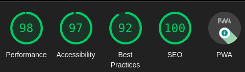

# My Portfolio

Welcome to my portfolio! I am Mohammed taysser and work a frontend developer with more than 2 years of experience building responsive and user-friendly websites and web applications. My expertise includes HTML, CSS, JavaScript, and other front-end technologies. Throughout my portfolio, you will see a variety of projects that demonstrate my ability to collaborate with designers and other developers to bring designs to life.

## Features

- Build in React & typescript
- Lint using Eslint
- Build with PWA in mind
- Fully responsive with Modern Design

## Contribution 🤝

1. Fork it!
2. Create your feature branch: `git checkout -b featureName`
3. Commit your changes: `git commit -am 'Some commit message'`
4. Push to the branch: `git push origin featureName`
5. Submit a pull request 😉

## License 📜

MIT © Mohammed Taysser
